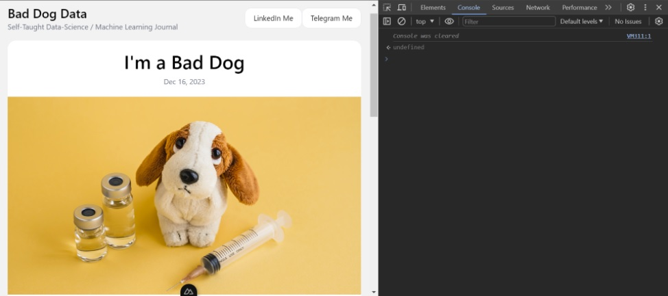

# Start to Code in These 3 Steps

You probably landed this page because you want to learn to code, which is great! Most people still didn't figure out what they want to do in their life, but you already did the hardest part. The coding is truely powerful skill. It enables you to write instructions to the machine which in turn builds staff like websites, mobile applications, rocket missiles launching systems and many more.

As Data Scientiests we use Coding skills to access, process and manage raw data, build graphs to visually comprehend the nature of dataset we ended-up working with, and eventually develop a statistical and machine learning models to predict the likelihood of certain events depending on the given task.

In this article we will focus on how to start coding immediately, without too much of a theory behind it. We will run a decent amount of lines of code by following the best practices of learning by doing. Please enjoy.

## Step 1: Learn to Code in a Browser

As you read this article through a webpage, you already have the tools at your fingertips. Press **Ctrl** + **Shift** + **J** if running on Windows or **Command** + **Option** + **J** if running on MacOS. It will open the console which appears to be on the right side of the browser in my case. It might appear on the bottom as well, but let's just focus on JavaScript.




JavaScript is an excellent language to start experimenting with, especially if you're attracted to dynamic interfaces. I encourage you to type all of the commands manually to have grasp feeling of what it's like to be a programmer.

#### Arithmetics

We will start with math operations using numbers and arithmetic signs in the console just like we would do using simple calculator. The result will be returned by the console line even before you hit the enter button, try it yourself.

```javascript
3 + 4 // Performs the addition

10 - 5 // Performs the substruction

25 * 3 // Perfroms the multiplication

125 / 5 // Performs division

5 ** 2 // Performs exponential

Math.sqrt(25) // The method to perform square root

clear() // function that clears the console for convinience, optional
```


Well Done my bad dog! Did you feel akward with the Math.sqrt() method ? You will learn about methods along the way, and don't worry if you missreading a couple of words or two. When learning a programming it's inevitable to come accross the concepts that are not yet familliar to you. Now let's get a little bit dirty and nail one of those concepts.

#### Variables

Let's create a variable **number** that will prompt you to store the value of any number.

```javascript
const number = prompt('Enter the square rootable number: ');
```

Now you are about to find out why it's getting dirty. When coding it's essential for a programmer to be very attentive and accurate to the command prompt. Let's try the following code and see what heppens.

```javascript
const result = Math.sqrt(number);
console.log(`The square root of ${number} is ${result}`);
```


If you are windy like me, there is a big chances your are confused the backtick sign *`*   with the quote sign  *'*   using which would not return the expected result. Eventually the learning curve will leave you frustruated with the console and error messages, but as aspiring progrmmers we should embrace it as the part of our job, and keep learning.

#### About JavaScipt

JavaScript is so bad ass that it covers everything. The Front and Back ends of web development, and even the mobile app frameworks for both Android and IOS devices. To put it into perspective, my beloved Python only handles the back-end for web apps. Lets input our last JavaScript code into the console and move on to something else.

```javascript
(function () {
  const canvas = document.createElement('canvas');
  document.body.appendChild(canvas);
  const ctx = canvas.getContext('2d');

  canvas.style.position = 'fixed';
  canvas.style.top = '0';
  canvas.style.left = '0';
  canvas.style.pointerEvents = 'none';

  function resizeCanvas() {
    canvas.width = window.innerWidth;
    canvas.height = window.innerHeight;
  }

  window.addEventListener('resize', resizeCanvas);
  resizeCanvas();

  const particles = [];

  class Particle {
    constructor() {
      this.x = Math.random() * canvas.width;
      this.y = Math.random() * canvas.height;
      this.size = Math.random() * 5 + 1;
      this.speedX = Math.random() * 3 - 1.5;
      this.speedY = Math.random() * 3 - 1.5;
      this.color = `hsl(${Math.random() * 360}, 100%, 50%)`;
    }

    update() {
      this.x += this.speedX;
      this.y += this.speedY;
      if (this.size > 0.2) this.size -= 0.1;
    }

    draw() {
      ctx.fillStyle = this.color;
      ctx.strokeStyle = 'black';
      ctx.lineWidth = 2;
      ctx.beginPath();
      ctx.arc(this.x, this.y, this.size, 0, Math.PI * 2);
      ctx.fill();
      ctx.stroke();
    }
  }

  function createParticles() {
    for (let i = 0; i < 100; i++) {
      particles.push(new Particle());
    }
  }

  function animate() {
    ctx.clearRect(0, 0, canvas.width, canvas.height);
    for (const particle of particles) {
      particle.update();
      particle.draw();
    }
    requestAnimationFrame(animate);
  }

  createParticles();
  animate();

  console.log(
    'Mind blown! 🤯 Check out the fullscreen mesmerizing particles!'
  );
})();
```

### Step 2: Learn to Code in Terminal

Just now we've been using browser as the mediator between the User and the Machine which is only possible with JavaScript, but now we would like to write instructions directly into the machine itself. If you're using a Windows operating system, you might need to make a few tweaks to ensure a seamless coding experience. While Windows is widely used and affordable, it's just never meant to be a developing machine. Whereas on MacOS you may just press **Command** + **Т** to find a Terminal and skip the next section.

#### Install WSL2 on Windows

In order to successfully run any code on the Windows machine, you should do it in the Windows Subsystem for Linux or **WSL2** environment for short. Linux has many advantages over Windows, but we will focus only on **Terminal**, and for that we should open the PowerShell as Administrator and run the following command

```powershell
wsl --install
```

Take a a little break, since the installation might take a few minutes

```powershell
wsl --list --online
```

This line of code will list the available Linux distributions. Choose any distro name. I'll choose Debian for demonstrative purposes, but you can install Ubuntu or Kali it doesn't really matter

```powershell
wsl --install -d Debian
```

After the installation you might need to restart your machine and check the start menu to see if there is a new Linux distribution available. Open your app, Debian in my case, and that's your Terminal


After installing our Linux distro, let's do something cool, try this command for instance:

```bash
sudo apt-get install && sudo apt-get upgrade
```

It should update your Linux system. Isn't cool ? You'd never miss any update with such a bad ass interactive interface. I litterally prompt this command every signle day, and it still blowing my mind.

#### Terminal and Python Shell

Now regardless of your Operating Sytem, you can run Python directly in your **Terminal** using the following command

```python
python3
```

```bash
Python 3.11.2 (main, Mar 13 2023, 12:18:29) [GCC 12.2.0] on linux
Type "help", "copyright", "credits" or "license" for more information.
>>>
```

As we are entered In the state of tripple arrows **>>>**, we are in so called **Python Shell** which is a powerful way to interact with your machine interactively. We can perform the same arithmetic commands as we did using JavaScript.

```python
1 + 1
2 * 5
5 ** 2
13 / 4
13 // 4 # This is a strict division
```

The square root is more tricky, to do that you have to import the Math module first.

```python
import math
math.sqrt(25)
```

While the neccessity of importing modules might look like a disadvantage when comparing to JavaScript. The modularity in Python is actually what makes it so widely used in many different fields from Machine Learning to Space Engineering, because there is just limitless amount of modules available for different purposes.

#### Lists

Now let's create a few variables using Python Shell.

```python
oranges = 5
kids = ['Aki', 'Kenshin', 'Konrat']
```

The first variable contains the number **5** representing the amount of oranges, and the second one contains the **list** of names representing kids names **Aki** , **Kenshin** and **Konrat** respectively. It's way more intuitive to create a variable when comparing to JavaScript, because of the Python's beautiful syntax, however we are paying the price for that ease of syntax, and the price is the **indentation**, which makes it a bit more challenging. We will get to that in the next section.

#### For loops

Now imaging that we have to supply our kids with oranges programmatically. Let's do that using the **for loop**, which is the sequance of instructions written in short. Make sure to follow the formating by entering the **tab** or **four spaces** on the lines 2 and 3 to align the instructions to the **for loop** statement as shown below. Also press double enter at the end of the input, it's just how it works in Python Shell.

```python
for i in kids:
    oranges -= 1
    print(f'{i} received an orange, {oranges} oranges remaining')
```

This code instructs to subtract 1 piece of orange and print the statment of remaining oranges after a certain kid received a fruit. The expected result is shown below.


#### If else

Now we've got a problem, there is just two oranges left for three of the kids. How would you solve this problem? If you are an old school parents like mine you might have a straightforward approach like so:

```python
for i in kids:
    if 'K' in kids:
        oranges -= 1
        print(f'{i} received an orange, {oranges} oranges remaining')
```

Which is basically a biased decision to give oranges to those who's more adorable to you, accidently it happens that both of their names contains big letter **K**. This is exactly how it's programmed in the line 2. But what about more responsible solution ?

```python
if oranges == 3:
    for i in kids:
        oranges -= 1
        print(f'{i} received an orange, {oranges} oranges remaining')
else:
    print('We are going to buy more oranges for our kids')
```

In this solution we initially check if the stock of oranges is equal to the exact number of our kids which is 3, if so we proceed as before, if not we are going to the marketplace to get more supplies.


If you got so far into the article, then you are true bad dog, congrats! As for now you are fammiliar with variables, lists, loops and If-else statements. You can have a deserved rest for a while, cause that was a lot to process for a bloody beginner.

### Step 3: Learn to Code in IDE

Just now we've been using Python Shell to directly communicate with the machine by one line at the time. In fact it's not the most effective way to write and execute the code. Now let's get ourself the Integrated Developing Environment or **IDE** for short which enables us to execute the numerous files of code. 

IDE is sort of a WordPad that has the integrated Terminal within it. The IDE that we are going to use is the **VS Code**, simply because most of the relevant tutorials that you are going to watch on YouTube going to use it as well.

#### VS Code

So to proceed further you should google the page where you can download **VS Code**. Intsall the **VS Code**, and open the application. If running on Linux environment you can open VS Code using this prompt in your Terminal after installaion.

```bash
code .
```

#### Projects and Directories

Open your Terminal and create the directory, for your project with this command.

```bash
mkdir orange_project
```

It creates a folder named **orange_project** in your WSL root directory. Projects are managed in directories accessible from your IDE. Look at the **VS Code** tool bar and choose the **File** , **Open Folder** it will drop-down the menu like on the picture shown below where you can choose any available directory. I'll choose **orange_project**.


Creating new files should be as easy, but choose **New File** instead of **Open Folder** in the tool bar. Alternatively you can click on those icons to create the file or the directory, remember the word **directory** is just a fancy way to say the **folder**.


Let's create two files in our orange project, I will name the first one as **script.js**, and the content of the file will have a single line as shown below, but you can follow your own mind and name it as you want and insert any text instead of 'Hello World'. There you go.

```javascript
console.log('Hello World');
```


After creating each file, remember to press **'Ctrl'** + **'S'** or go to **File** and hit **Save**. Otherwise VS Code would not be able to find your files in the project. The second file will be the same programm, but written in Python and named **script.py**

```python
print("Hello, World!")
```


Then go back to the Terminal and try to navigate between the directories. 

```bash
pwd
```

This will output your current directory, which should be look siimiliar to mine

```bash
/home/bad_dog
```

Look at available directories inside your current directory

```bash
ls
```

This will output all of the folders available in your directory

```bash
alpine  gemini  nuxt-content  orange_project
```

Change the directory to orange_project where our new files located at

```bash
cd orange_project
```

Look at the available files inside the directory

```bash
ls
```

You should see new files in there, if not then go back to VS Code and save files again.

```bash
script.js  script.py
```

Run both files with this commands

```bash
python3 script.py
node script.js
```


And Voila. We've just successfully executed both Python and JavaScript files.

## Conclusion

In this article we accessed the console in the browser , installed the Linux Terminal and even created bilingual project using VS Code. It's way too much for the first experience with programming so congrats you with such a milestone.

You should bear in mind that I've wrote this article for a complete beginners to have a solid hands-on experience, but you still have to learn the basics and theory to back-up this practice. So follow the FAQ section below to see the recommendations.

Also follow me on LinkedIn to stay up to date for a new articles in this series of **How to Start Coding: From Zero to Hero**.

## FAQ from Coding Beginners

### What's better JavaScript or Python?

It depends on what is your final goal. If you trying to build a website then JavaScript is essential for the front-end elements that users going to interact with. For Machine Learning tasks you are going to use Python modules, that will save you a lifetime amount of work instead of writing them in JavaScipt from the scratch. For a Statistical Learning **R** is the way to go. So focus on your goal and the choice of programming language will come easy.

### Can I pivot from Data Science to Software Engineering?

Indeed many people realize that Math and Statistics is just too boring, thus Machine Learning seems less tangible. Software Engineering is more about building actual staff, whereas Data Science is like: "I can say with 96% confidence level that bad dogs drink coffee on alternative milk only!". So Yes, Software Engineeing is cool indeed, and no shame in switching to that.

### What Should I learn next to be a good coder?

You can start with YouTube **CS50** courses by Harvard. It will back you up with solid fundumentals to better understand the content you've red so far. It's also essential if you want to work in Tech companies, so just start with that and keep wondering what's next. Another source I'd recommend is the [interview.schools](https://interview.schools). This is the website developed by Google employee guiding user to prepare for the interview in companies like MANG.

### Should I Read Programming Books?

This is another good resource for a contextual learning. However there is just so much to cover as a beginner. I'd rather focus on IT basics like HTTP, Network Protocols, Binary Code Processing, Data Types and Data Structures, Data Bases and so much more, so internet and Google are better at this point.

### Should I use LLM's like ChatGPT and Gemini?

Sure yes! The only scenario that is not suitable for LLM's are the homeworks that on the edge of the deadline, cause the temptation to copy paste the response without further analysis is quite high, so be curiouse and critical to every response, cause LLM's sometimes tends to hallucinate.
